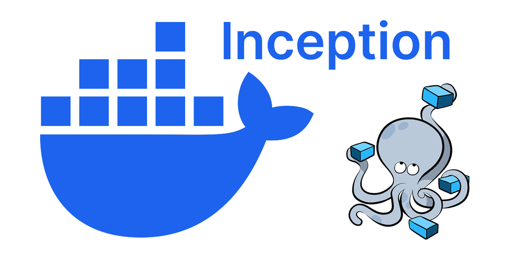

---

## 🌟 Welcome to **Inception** 🌟

> "The beginning is the most important part of the work." – *Plato*

[](https://42.fr)
[](https://www.docker.com/)
[](https://nginx.org/)

---

## 🛠️ Project Overview

**Inception** is a comprehensive system administration project from 42 School that challenges you to build a complete web infrastructure using **Docker containers**. This project involves deploying a secure, production-ready web application stack with **WordPress**, **MariaDB**, and **Nginx** using **Docker Compose**.

### 🎯 Core Challenge
- Build each service from scratch using custom Dockerfiles
- Implement HTTPS-only configuration with TLSv1.3
- Create a secure, isolated multi-container environment
- Master Docker networking and volume management

---

## 🚀 Key Learning Objectives

- ✅ **Docker Fundamentals**: Understanding containerization principles
- ✅ **Multi-Container Architecture**: Orchestrating services with Docker Compose
- ✅ **Security Best Practices**: HTTPS-only, TLS 1.3, SSL certificates
- ✅ **Web Server Configuration**: Advanced Nginx setup
- ✅ **Database Management**: MariaDB configuration and optimization
- ✅ **DevOps Skills**: Infrastructure as Code, container orchestration

---

## 📂 Project Architecture

```plaintext
/home/nrabehar/lab/inception/
├── 📄 docker-compose.yml          # Container orchestration
├── 📄 README.md                   # Project documentation
├── 🖼️  img/
│   └── bg.png                     # Project banner
└── 📁 srcs/
    └── requirements/
        ├── 🐳 nginx/              # Reverse proxy & SSL termination
        │   ├── Dockerfile         # Custom nginx build
        │   └── conf/
        │       └── nginx.conf     # HTTPS-only configuration
        ├── 🐳 wordpress/          # WordPress application
        │   ├── Dockerfile
        │   └── conf/
        └── 🐳 mariadb/            # Database service
            ├── Dockerfile
            └── conf/
```

---

## 🔧 Technology Stack

| Service | Technology | Purpose | Configuration |
|---------|------------|---------|---------------|
| **Web Server** |  | Reverse proxy, SSL termination | HTTPS-only, TLSv1.3, HTTP/2 |
| **Application** |  | CMS & Web Application | PHP-FPM, Custom configuration |
| **Database** |  | Relational Database | Optimized for WordPress |
| **Containerization** |  | Container platform | Custom Dockerfiles |
| **Orchestration** |  | Service orchestration | Multi-container management |

---

## 🔒 Security Features

### Nginx Security Configuration
- **HTTPS Only**: No HTTP traffic allowed
- **TLS 1.3**: Latest encryption protocol
- **Strong Ciphers**: Modern encryption algorithms
- **Security Headers**: XSS, CSRF, clickjacking protection
- **Domain Restriction**: Only serves `nrabehar.42.fr`

### SSL/TLS Configuration
```nginx
ssl_protocols TLSv1.3;
ssl_ciphers ECDHE-RSA-AES256-GCM-SHA384:ECDHE-RSA-CHACHA20-POLY1305:ECDHE-RSA-AES128-GCM-SHA256;
add_header Strict-Transport-Security "max-age=31536000; includeSubDomains" always;
```

---

## 🚀 Quick Start

### Prerequisites
- Docker Engine 20.10+
- Docker Compose 2.0+
- 4GB+ RAM
- 10GB+ free disk space

### 1. Clone the Repository
```bash
git clone <repository-url>
cd inception
```

### 2. Configure Environment
```bash
# Set up domain in /etc/hosts (for local testing)
echo "127.0.0.1 nrabehar.42.fr" | sudo tee -a /etc/hosts
```

### 3. Build and Deploy
```bash
# Build all services
docker-compose build

# Start the infrastructure
docker-compose up -d

# Check service status
docker-compose ps
```

### 4. Access the Application
- **Website**: https://nrabehar.42.fr
- **WordPress Admin**: https://nrabehar.42.fr/wp-admin

---

## 📊 Service Details

### 🌐 Nginx (Reverse Proxy)
- **Port**: 443 (HTTPS only)
- **Features**: HTTP/2, SSL termination, security headers
- **Configuration**: Custom nginx.conf with TLSv1.3

### 📝 WordPress (Application)
- **Backend**: PHP-FPM
- **Features**: Custom installation, optimized configuration
- **Volumes**: Persistent data storage

### 🗄️ MariaDB (Database)
- **Version**: Latest stable
- **Features**: Optimized for WordPress
- **Volumes**: Persistent database storage

---

## 🔍 Monitoring & Troubleshooting

### Check Service Status
```bash
# View all containers
docker-compose ps

# Check logs
docker-compose logs nginx
docker-compose logs wordpress
docker-compose logs mariadb

# Execute commands in containers
docker-compose exec nginx nginx -t
docker-compose exec wordpress wp --info
```

### Common Issues
- **SSL Certificate Warnings**: Expected with self-signed certificates
- **Domain Resolution**: Ensure `/etc/hosts` entry is correct
- **Port Conflicts**: Make sure port 443 is available

---

## 🧪 Testing

### SSL/TLS Testing
```bash
# Test SSL configuration
curl -I https://nrabehar.42.fr

# Check TLS version
openssl s_client -connect nrabehar.42.fr:443 -tls1_3

# Verify certificate
openssl x509 -in /path/to/cert -text -noout
```

### Performance Testing
```bash
# HTTP/2 support
curl --http2 -I https://nrabehar.42.fr

# Load testing
ab -n 1000 -c 10 https://nrabehar.42.fr/
```

---

## 📚 Documentation

### 42 School Requirements
- ✅ Custom Dockerfiles (no ready-made images)
- ✅ HTTPS-only with TLS 1.2/1.3
- ✅ Domain name configuration
- ✅ Volumes for data persistence
- ✅ Docker network for service communication
- ✅ Automatic container restart

### Additional Resources
- [Docker Documentation](https://docs.docker.com/)
- [Nginx Configuration Guide](https://nginx.org/en/docs/)
- [WordPress Docker Guide](https://hub.docker.com/_/wordpress)
- [MariaDB Documentation](https://mariadb.org/documentation/)

---

## 👤 Author

**nrabehar** - 42 School Antananarivo
- GitHub: [@nrabehar](https://github.com/nrabehar)
- Email: nrabehar@student.42antananarivo.mg

---

## 📜 License

This project is part of the 42 School curriculum and follows the school's academic policies.

---

## 🙏 Acknowledgments

- **42 School** for the comprehensive curriculum
- **Docker Community** for excellent documentation
- **Nginx Team** for the robust web server
- **WordPress & MariaDB** communities

---

*"We must go deeper..." - Inception (2010)*

🚢✨ **Happy containerizing!** ✨🚢
